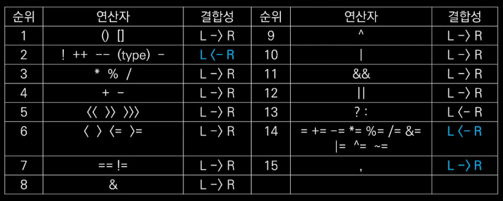

# 9. 연산자 - 첫번째

## 연산자 기본 이론

- **연산 = 실행 = cpu가 명령을 수행**하는것
  (명령의 대부분이 연산에 대한 명령임)
- 연산자는 **cpu 연산과 직결**되는 문법

##### 연산식

- **연산자 + 피연산자**로 구성
- 필요한 **피연산자의 수**에 따라 **단항 연산자, 2항 연산자, 3항 연산자** 라고 부른다.
  - **'+'**는 이항연산자 항이 두개 필요해서
  - ` a + b`

### 연산자 우선 순위와 결합성

    

- 막 외울 필요는 없고 기본적으론 **상식**선에서 해결하나 필요할때 검색으로 알아본다.

#### 연산자 결합성

- **우선순위**가 같을때 **어떤 것을 먼저**할지를 나타내는것
- `3+4+5` 이 덧셈 연산은 **우선순위**가 같고 **결합성이 L -> R** 이기 때문에
  `3+4` 부터 수행한다. `(3+4)+5` 이런식으로
